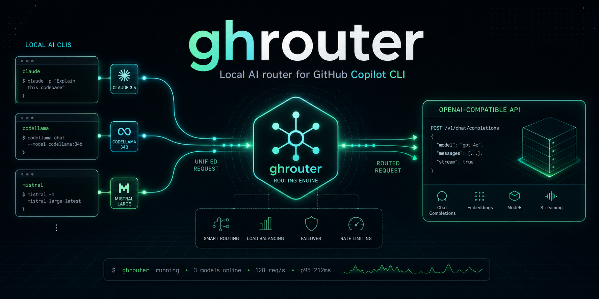
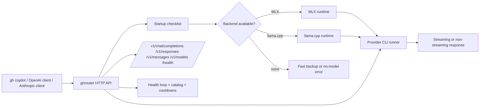
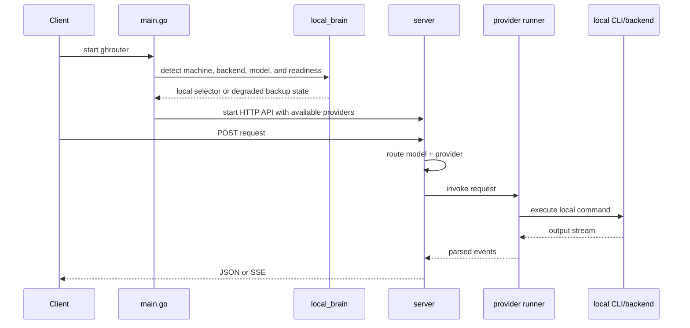

# ghrouter

[](https://go.dev)
[](https://github.com/jcafeitosa/ghrouter/actions/workflows/ci.yml)
[](https://github.com/jcafeitosa/ghrouter/releases)



> **Local AI router for GitHub Copilot CLI** — Discovers supported local provider CLIs when available, builds a provenance-aware model catalog, exposes OpenAI- and Anthropic-shaped endpoints, and routes requests through one transparent local gateway. It includes a Bubble Tea dashboard and explicit startup diagnostics.

> **Implementation status:** this repository is an active development build. The local Brain is the primary selector and defaults to a small MLX coding model when no Brain is configured; a measured fast model is the runtime backup, and requests fail explicitly when no model is available. Warm process pools, universal quota discovery, and several production controls remain incomplete. See [`docs/implementation-status.md`](docs/implementation-status.md) before relying on a feature.

## Target Runtime

- Detects the machine environment at startup.
- Detects or attaches to the local Brain on official MLX/llama.cpp servers when available.
- Discovers installed external CLI providers, reports their authentication
  signals, and loads their native model catalogs when available.
- Completes an empty Brain configuration with `GHR_LOCAL_BRAIN_MODEL`/`GHR_LOCAL_BRAIN_SOURCE` or the default MLX coding model and may download it through the allowlisted `hf` command.
- Exposes one router endpoint for `gh copilot` and other clients.
- Keeps routing, health, and model catalog logic behind a single HTTP surface.

---

## Architecture



## Runtime Flow



## System Summary

`ghrouter` is designed to behave like a small local control plane:

- it checks the machine first,
- makes sure the expected backend exists,
- reports model-cache and provider preflight,
- then serves model requests through one stable API.

That keeps `gh copilot` pointed at one local endpoint while the project manages provider discovery, routing, health, and model availability. Missing authentication is reported explicitly; it is never bypassed. A successful startup or ACP handshake still does not guarantee provider-side inference capacity.

---

## Quick Start

### Prerequisites
- **Go 1.26+** (for building from source)
- At least one supported CLI installed and authenticated:
  - `claude` — [Claude Code](https://github.com/anthropics/claude-code) (`claude auth login`)
  - `codex` — [Codex CLI](https://github.com/openai/codex) (`codex login`)
  - `opencode` — [OpenCode](https://github.com/sst/opencode) (use the installed CLI's current auth/providers flow)
  - `mimo` — [Mimo](https://github.com/mimocode/mimocode) (use the installed CLI's current auth/providers flow)
  - `pi` — [Pi](https://github.com/pi/pi) (`pi auth`)
  - `cursor` — [Cursor CLI](https://cursor.com/docs/cli/overview) (`CURSOR_API_KEY` / `agent login`)

### Install

```bash
# From source
git clone https://github.com/jcafeitosa/ghrouter
cd ghrouter
go build -o ghrouter

# Or install pre-built binary (releases)
# Use the GitHub Releases page when pre-built artifacts are published.
```

### Run

```bash
# Opens the interactive router dashboard and discovers installed CLIs
./ghrouter

# Headless server mode
./ghrouter serve

# With custom config
GHR_CONFIG=./config.yaml ./ghrouter
```

### Connect gh copilot

```bash
# Terminal (GitHub Copilot CLI uses `copilot`; older `gh copilot` wrappers may differ)
eval "$(./ghrouter connect copilot)"
copilot

# Or one-shot
COPILOT_PROVIDER_BASE_URL=http://127.0.0.1:9090/v1 \
COPILOT_PROVIDER_TYPE=openai \
COPILOT_PROVIDER_WIRE_API=responses \
COPILOT_PROVIDER_MODEL_ID=gpt-5.4 \
COPILOT_PROVIDER_WIRE_MODEL=ghrouter/auto \
COPILOT_MODEL=ghrouter/auto \
copilot -p "explain this code"
```

`ghrouter/auto`, `ghrouter/opencode`, and `ghrouter/codex` are Ghrouter virtual model-list names,
not GitHub-hosted model names. Copilot's BYOK mode accepts these custom IDs
and sends them to Ghrouter for resolution. If a client needs a known
capability profile, set `COPILOT_PROVIDER_MODEL_ID` (for example `gpt-5.4`)
and keep the virtual list in `COPILOT_PROVIDER_WIRE_MODEL`.

---

## Supported Providers

| CLI | Command | Auth | Models (examples) |
|-----|---------|------|-------------------|
| **claude** | `claude --print --output-format=stream-json --no-session-persistence` | `claude auth login` / `ANTHROPIC_API_KEY` | Native installed catalog |
| **codex** | `codex app-server --stdio` for catalog; `codex exec --json --ephemeral --skip-git-repo-check` for requests | `codex login` / `OPENAI_API_KEY` | Native installed catalog |
| **opencode** | `opencode acp --pure` when ACP is confirmed; native `run --format json --pure` fallback | CLI-specific auth/providers flow | Native installed catalog |
| **mimo** | `mimo acp --pure` when ACP is confirmed; native `run --format json --pure` fallback | `mimo auth login` | Native installed catalog |
| **pi** | `pi --mode json --print --no-session --no-context-files` | `pi auth` / provider-specific credentials | Native installed catalog |
| **cursor** | `agent --trust acp` for catalog and requests | `CURSOR_API_KEY` / `agent login` | ACP-reported installed catalog |

Models are auto-prefixed: `cc/`, `cx/`, `oc/`, `mi/`, `pi/`, `cu/`. An explicit
prefix pins a request to that CLI; an unavailable or unverified prefixed model
does not silently fall through to another provider. A configured unverified
model may still be invoked explicitly so its real provider error can be
observed. Use `ghrouter/auto` or a
configured route/list when cross-provider fallback is intended.

Client profiles are generated without changing global settings:

```bash
eval "$(./ghrouter connect copilot)"
./ghrouter connect codex --install
eval "$(./ghrouter connect codex)"
eval "$(./ghrouter connect claude)"
eval "$(./ghrouter connect opencode)"
eval "$(./ghrouter connect mimo)"
eval "$(./ghrouter connect pi)"
eval "$(./ghrouter connect cursor)"
```

Codex custom routing uses its isolated native provider configuration. After
installation, use `codex exec --model auto` for an explicit routed request.
Cursor Agent uses ACP for backend discovery and requests: Ghrouter creates an
ACP session, selects the requested `cu/<model>` when the installed catalog
offers it, and forwards the prompt through `session/prompt`.

OpenCode and MiMo use the same ACP session shape when the installed CLI passes
the live handshake: Ghrouter selects the requested native model through
`configOptions.model` and sends `session/prompt`. A CLI without a confirmed ACP
handshake uses its native JSON adapter instead.

The profiles only point clients at the loopback router. They do not copy provider
credentials. When ACL is enabled, set `GHR_ACCESS_TOKEN` in the client shell and
configure the same token for the Ghrouter process. GitHub Copilot CLI's native
BYOK contract uses `COPILOT_PROVIDER_BASE_URL`, `COPILOT_PROVIDER_TYPE`,
`COPILOT_PROVIDER_WIRE_API`, and `COPILOT_MODEL`. Claude Code uses
`ANTHROPIC_BASE_URL` plus its documented gateway credential. Cursor Agent's
`CURSOR_API_ENDPOINT` profile is a separate client-mode compatibility path:
Cursor's documented ACP backend is the supported Ghrouter integration, while
the custom endpoint is not claimed as a working OpenAI connection.

An ACP-discovered model is catalog evidence, not proof of usable inference.
Until `ghrouter probe <model>` or a real routed request succeeds, the model is
reported as `unknown` and is excluded from generated automatic lists. Auth,
plan, quota, and provider-side errors remain visible rather than being
replaced with simulated health.

---

## Routing Modes

ghrouter exposes **combo modes** for intelligent model selection:

### Fallback Chain
```yaml
routes:
  - pattern: "cc/*"
    provider: "claude-code"
    fallback: ["codex", "opencode"]
```
Tries primary, falls back on error/timeout/cooldown.

### Round-Robin Pool
```yaml
routes:
  - pattern: "pool/fast"
    provider: "round-robin"
    fallback: ["cx/gpt-5.4", "oc/sonnet", "pi/gpt-5-mini"]
```
Distributes requests evenly across healthy providers.

### Fusion (fan-out and optional judge)
```yaml
routes:
  - pattern: "fusion/code"
    provider: "fusion"
    fallback: ["cx/<native-model>", "oc/<native-model>"]
```
Fans out across healthy candidates for Chat Completions, Responses, and
Anthropic Messages. An optional judge can synthesize the candidate answers;
`max_candidates` and `judge_timeout` bound the work.

### Sticky Sessions
```yaml
routes:
  - pattern: "sticky/*"
    provider: "sticky"
```
Routes same conversation ID to same provider for context continuity.

### Auto-Capacity Switching
```yaml
routes:
  - pattern: "auto/*"
    provider: "auto"
```
Picks a candidate based on real-time health and available catalog metadata.
Cost, quota and capability values are only used when actually supplied; there
is no universal provider billing reader.

### Cooldown Manager
Models that return errors / timeouts enter cooldown (starting at 30s, with exponential backoff up to 10m). The router skips them during the window; after expiry they remain out of generated lists until a fresh real probe succeeds. Provider quota/reset signals quarantine every model in that provider until the explicit reset time.

---

## Configuration

```yaml
# config.yaml
listen_port: 9090

providers:
  - name: "claude-code"
    type: "claude-code"
    cli_path: "/usr/local/bin/claude"
    args: ["--print", "--output-format=stream-json", "--no-session-persistence"]
    enabled: true

  - name: "codex"
    type: "codex"
    cli_path: "/usr/local/bin/codex"
    args: ["exec", "--json", "--ephemeral", "--skip-git-repo-check"]
    enabled: true

  - name: "opencode"
    type: "opencode"
    cli_path: "/usr/local/bin/opencode"
    args: ["run", "--format", "json", "--pure"]
    enabled: true

  - name: "mimo"
    type: "mimo"
    cli_path: "/usr/local/bin/mimo"
    args: ["run", "--format", "json", "--pure"]
    enabled: true

  - name: "pi"
    type: "pi"
    cli_path: "/usr/local/bin/pi"
    args: ["--mode", "json", "--print", "--no-session", "--no-context-files"]
    enabled: true

  - name: "cursor"
    type: "cursor"
    cli_path: "/usr/local/bin/cursor"
    args: ["agent", "-p", "--output-format", "stream-json", "--stream-partial-output"]
    enabled: true

routes:
  - pattern: "cc/*"
    provider: "claude-code"
    fallback: ["codex", "opencode"]
  - pattern: "cx/*"
    provider: "codex"
    fallback: ["claude-code"]
  - pattern: "oc/*"
    provider: "opencode"
  - pattern: "mi/*"
    provider: "mimo"
  - pattern: "pi/*"
    provider: "pi"
  - pattern: "cu/*"
    provider: "cursor"
  - pattern: "auto/*"
    provider: "auto"
  - pattern: "pool/*"
    provider: "round-robin"
  - pattern: "fusion/*"
    provider: "fusion"
  - pattern: "sticky/*"
    provider: "sticky"
```

---

## API Endpoints

| Endpoint | Method | Description |
|----------|--------|-------------|
| `/v1/chat/completions` | POST | OpenAI Chat Completions (stream + non-stream) |
| `/v1/responses` | POST | OpenAI Responses-shaped routed output (JSON + response SSE) |
| `/v1/models` | GET | List observed models with ownership; add `?functional_only=true` for verified, healthy, routable models only |
| `/health` | GET | Provider health, model readiness (`catalog`, `verified`, `verified_healthy`) + uptime |
| `/metrics` | GET | Prometheus request, provider and model metrics |
| `/livez` | GET | Process liveness probe |
| `/readyz` | GET | Passive provider/executable readiness; not proof of inference |
| `/` | GET | Info page |

### Example Request

```bash
curl -X POST http://127.0.0.1:9090/v1/chat/completions \
  -H "Content-Type: application/json" \
  -d '{
    "model": "cx/gpt-5.4-mini",
    "messages": [{"role": "user", "content": "Explain Go channels in 3 sentences"}],
    "stream": true
}'
```

Replace the example model with an ID shown by `ghrouter models`; the ID above
was observed on the development host and is not a universal catalog promise.

### Streaming Response (SSE)

```text
data: {"id":"chatcmpl-...","object":"chat.completion.chunk","created":...,"model":"cx/gpt-5.4-mini","choices":[{"index":0,"delta":{"role":"assistant"}}]}

data: {"id":"chatcmpl-...","object":"chat.completion.chunk","created":...,"model":"cx/gpt-5.4-mini","choices":[{"index":0,"delta":{"content":"Go channels"}}]}

data: {"id":"chatcmpl-...","object":"chat.completion.chunk","created":...,"model":"cx/gpt-5.4-mini","choices":[{"index":0,"delta":{"content":" enable safe"}}]}

data: {"id":"chatcmpl-...","object":"chat.completion.chunk","created":...,"model":"cx/gpt-5.4-mini","choices":[{"index":0,"delta":{},"finish_reason":"stop"}]}

data: [DONE]
```

---

## CLI Commands

```bash
ghrouter                    # Start server (auto-detects CLIs)
ghrouter --config path.yaml # Use custom config
ghrouter init               # Interactive wizard (creates config.yaml)
ghrouter doctor             # Non-billing CLI/auth/model preflight; not inference
ghrouter bootstrap          # Sync config and validate startup prerequisites
ghrouter export             # Export config + runtime snapshot bundle
ghrouter import <bundle>    # Restore config from a bundle
ghrouter config             # View/edit current config
ghrouter providers          # List detected providers and models
ghrouter models             # List catalog with health/cooldown status
ghrouter models --functional-only --provider nvidia --capability tool-use
                            # Filter to currently healthy, tool-capable models
ghrouter routes             # Show routing table
ghrouter live               # Real-time router dashboard and snapshot
ghrouter test <model>       # Real bounded smoke test for a resolved model
ghrouter probe <model>      # Real bounded probe; accepts a short response and records cooldown on failure
ghrouter verify-models      # Concurrent real verification of discovered models
ghrouter version            # Show version
```

---

## Model Catalog & Health

ghrouter maintains a **live catalog** of discovered models with:
- Provider source
- Auth status
- Passive health and explicit request evidence (latency, success/error)
- Cooldown state (until when skipped)
- Capability tags (code, reasoning, vision, tool-use, long-context)
- Cost tier (free, cheap, standard, premium)

Passive health checks run periodically without sending a paid prompt. Real
requests and explicit probes add inference evidence; unhealthy providers/models
can enter cooldown.
Metadata is provider-reported or configured; Ghrouter does not invent missing
cost, quota, context, effort, vision, or tool-use values.

---

## Compatibility

| Check | Status |
|-------|--------|
| OpenAI Chat Completions format | ✅ |
| SSE streaming (`stream=true`) | ✅ |
| Tool calls pass-through | ⚠️ depends on provider-native output |
| `/v1/models` endpoint | ✅ |
| Model prefix routing (`cc/`, `cx/`, ...) | ✅ |
| gh copilot BYOK profile | ✅ installed-client fixture prompt verified through `/v1/responses`; backend auth/quota remains environment-dependent |
| No hidden protocol interception | ✅ |
| No token scraping | ✅ |
| Uses only documented CLI flags | ⚠️ version-sensitive; verify with `ghrouter doctor` |

For the complete delivered/partial/roadmap matrix, see
[`docs/implementation-status.md`](docs/implementation-status.md).

---

## Security

- **Zero token interception** — uses each CLI's own authenticated subprocess
- **No MITM** — no proxying of provider API traffic
- **Local only** — binds to `127.0.0.1` by default
- **Env var inheritance** — filters client-only variables before spawning a provider
- **No automatic telemetry** — normal routing stays local; updater and explicit provisioning may make external calls when invoked

## Logs and errors

Ghrouter emits categorized structured logs through `log/slog`. Configure
`GHR_LOG_LEVEL=debug` for diagnostic events, `GHR_LOG_FORMAT=json` for log
collectors, and `GHR_LOG_COLOR=always|never` for terminal output. See
[`docs/observability.md`](docs/observability.md). Provider credentials,
prompts, tool arguments and raw provider stderr are not exposed in public
errors or dashboard output.

---

## Performance

- **Bounded provider reuse** — most provider CLIs run as bounded subprocesses; a
  warm ACP process/session pool is used for observed serve-capable OpenCode and
  MiMo installations. Pi and generic HTTP serve contracts remain unvalidated.
- **Parallel health checks** — non-blocking
- **Lock-free hot path** — read-heavy routing uses `sync.RWMutex`
- **Minimal JSON parsing** — streams CLI output directly to SSE
- **Bounded routing** — model/prefix/catalog selection with health state; no benchmark claim is made for sub-millisecond latency

---

## Development

```bash
# Setup
go mod tidy

# Format + vet + race test
gofmt -w .
go vet ./...
go test -race ./...

# Build
go build -o ghrouter

# Run the server
./ghrouter
```

---

## License

No `LICENSE` file has been published in this repository yet. Licensing terms
must be added before a release claim is made.

---

## Contributing

1. Fork
2. Create feature branch
3. Pass all quality gates (`go build`, `go vet`, `go test -race`, `staticcheck`)
4. Test against at least 2 real CLIs
5. Verify `gh copilot` compatibility
6. PR with clear description

---

## Related

- [GitHub Copilot CLI BYOK docs](https://docs.github.com/en/copilot/how-tos/copilot-cli/customize-copilot/use-byok-models)
- [Claude Code](https://github.com/anthropics/claude-code)
- [Codex CLI](https://github.com/openai/codex)
- [OpenCode](https://github.com/sst/opencode)
- [Mimo](https://github.com/mimocode/mimocode)
- [Pi](https://github.com/pi/pi)
