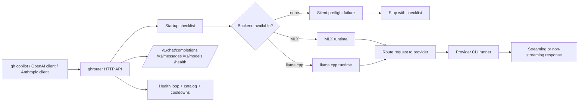
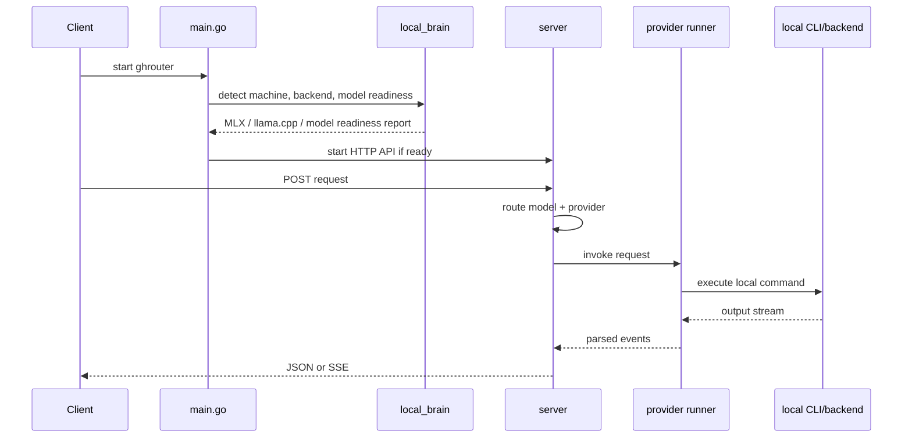

# ghrouter

[](https://go.dev)
[](https://github.com/jcafeitosa/ghrouter/actions)
[](LICENSE)
[](https://github.com/jcafeitosa/ghrouter/releases)


> **Local AI router for GitHub Copilot CLI** — Auto-discovers local provider CLIs, validates the local runtime, exposes OpenAI- and Anthropic-compatible endpoints, and routes requests through a single transparent gateway. Zero-config first run, with silent startup checks and a live terminal dashboard.

## Target Runtime

- Detects the machine environment at startup.
- Checks whether MLX or llama.cpp is available.
- Verifies that supported backends and models are present before serving traffic.
- Exposes one router endpoint for `gh copilot` and other clients.
- Keeps routing, health, and model catalog logic behind a single HTTP surface.

---

## Architecture



## Runtime Flow



## System Summary

`ghrouter` is designed to behave like a small local control plane:

- it checks the machine first,
- makes sure the expected backend exists,
- verifies the model cache and provider readiness,
- then serves model requests through one stable API.

That keeps `gh copilot` pointed at one local endpoint while the project manages provider discovery, routing, health, and model availability behind the scenes.

---

## Quick Start

### Prerequisites
- **Go 1.23+** (for building from source)
- At least one supported CLI installed and authenticated:
  - `claude` — [Claude Code](https://github.com/anthropics/claude-code) (`claude auth login`)
  - `codex` — [Codex CLI](https://github.com/openai/codex) (`codex login`)
  - `opencode` — [OpenCode](https://github.com/sst/opencode) (`opencode auth login`)
  - `mimo` — [Mimo](https://github.com/mimocode/mimocode) (`mimo auth login`)
  - `pi` — [Pi](https://github.com/pi/pi) (`pi auth`)
  - `cursor` — [Cursor CLI](https://cursor.com/docs/cli/overview) (`CURSOR_API_KEY` / `agent login`)

### Install

```bash
# From source
git clone https://github.com/jcafeitosa/ghrouter
cd ghrouter
go build -o ghrouter

# Or install pre-built binary (releases)
# Use the GitHub Releases page when pre-built artifacts are published.
```

### Run

```bash
# Zero-config: opens the interactive router dashboard and auto-discovers installed CLIs
./ghrouter

# Headless server mode
./ghrouter serve

# With custom config
GHR_CONFIG=./config.yaml ./ghrouter
```

### Connect gh copilot

```bash
# Terminal
export COPILOT_PROVIDER_BASE_URL=http://127.0.0.1:9090
export COPILOT_MODEL=cc/claude-opus-5
gh copilot

# Or one-shot
COPILOT_PROVIDER_BASE_URL=http://127.0.0.1:9090 \
COPILOT_MODEL=cx/gpt-5 \
gh copilot "explain this code"
```

---

## Supported Providers

| CLI | Command | Auth | Models (examples) |
|-----|---------|------|-------------------|
| **claude** | `claude --print --output-format=stream-json --no-session-persistence` | `claude auth login` / `ANTHROPIC_API_KEY` | `claude-opus-5`, `claude-sonnet-5`, `claude-haiku-4-5`, `claude-fable-5` |
| **codex** | `codex exec --json --ephemeral --skip-git-repo-check` | `codex login` / `OPENAI_API_KEY` | `gpt-5`, `gpt-4o`, `o3` |
| **opencode** | `opencode run --format json --no-remote` | `opencode auth login` | Provider-defined |
| **mimo** | `mimo run --format json --pure` | `mimo auth login` | Provider-defined |
| **pi** | `pi --mode json --print --no-session --no-context-files` | `pi auth` / `GOOGLE_API_KEY` | `anthropic/claude-sonnet-5`, `openai/gpt-5` |
| **cursor** | `agent -p --output-format stream-json --stream-partial-output --model <id>` | `CURSOR_API_KEY` / `agent login` | `composer-2`, `composer2-fast` |

Models are auto-prefixed: `cc/`, `cx/`, `oc/`, `mi/`, `pi/`, `cu/`.

---

## Routing Modes

ghrouter exposes **combo modes** for intelligent model selection:

### Fallback Chain
```yaml
routes:
  - pattern: "cc/*"
    provider: "claude-code"
    fallback: ["codex", "opencode"]
```
Tries primary, falls back on error/timeout/cooldown.

### Round-Robin Pool
```yaml
routes:
  - pattern: "pool/fast"
    provider: "round-robin"
    fallback: ["cx/gpt-4o", "oc/sonnet", "pi/gpt-5-mini"]
```
Distributes requests evenly across healthy providers.

### Fusion (Parallel + Select Best)
```yaml
routes:
  - pattern: "fusion/code"
    provider: "fusion"
    fallback: ["cc/claude-opus-5", "cx/o3", "oc/sonnet"]
```
Sends to multiple providers in parallel, returns first complete response.

### Sticky Sessions
```yaml
routes:
  - pattern: "sticky/*"
    provider: "sticky"
```
Routes same conversation ID to same provider for context continuity.

### Auto-Capacity Switching
```yaml
routes:
  - pattern: "auto/*"
    provider: "auto"
```
Picks provider based on real-time health, latency, cost, and capability match.

### Cooldown Manager
Models that return errors / timeouts enter cooldown (default 60s). Router skips them until cooldown expires.

---

## Configuration

```yaml
# config.yaml
listen_port: 9090

providers:
  - name: "claude-code"
    type: "claude-code"
    cli_path: "/usr/local/bin/claude"
    args: ["--print", "--output-format=stream-json", "--no-session-persistence"]
    enabled: true

  - name: "codex"
    type: "codex"
    cli_path: "/usr/local/bin/codex"
    args: ["exec", "--json", "--ephemeral", "--skip-git-repo-check"]
    enabled: true

  - name: "opencode"
    type: "opencode"
    cli_path: "/usr/local/bin/opencode"
    args: ["run", "--format", "json", "--no-remote"]
    enabled: true

  - name: "mimo"
    type: "mimo"
    cli_path: "/usr/local/bin/mimo"
    args: ["run", "--format", "json", "--pure"]
    enabled: true

  - name: "pi"
    type: "pi"
    cli_path: "/usr/local/bin/pi"
    args: ["--mode", "json", "--print", "--no-session", "--no-context-files"]
    enabled: true

routes:
  - pattern: "cc/*"
    provider: "claude-code"
    fallback: ["codex", "opencode"]
  - pattern: "cx/*"
    provider: "codex"
    fallback: ["claude-code"]
  - pattern: "oc/*"
    provider: "opencode"
  - pattern: "mi/*"
    provider: "mimo"
  - pattern: "pi/*"
    provider: "pi"
  - pattern: "auto/*"
    provider: "auto"
  - pattern: "pool/*"
    provider: "round-robin"
  - pattern: "fusion/*"
    provider: "fusion"
  - pattern: "sticky/*"
    provider: "sticky"
```

---

## API Endpoints

| Endpoint | Method | Description |
|----------|--------|-------------|
| `/v1/chat/completions` | POST | OpenAI Chat Completions (stream + non-stream) |
| `/v1/models` | GET | List available models with ownership |
| `/health` | GET | Health check + uptime |
| `/` | GET | Info page |

### Example Request

```bash
curl -X POST http://127.0.0.1:9090/v1/chat/completions \
  -H "Content-Type: application/json" \
  -d '{
    "model": "cc/claude-opus-5",
    "messages": [{"role": "user", "content": "Explain Go channels in 3 sentences"}],
    "stream": true
  }'
```

### Streaming Response (SSE)

```text
data: {"id":"chatcmpl-...","object":"chat.completion.chunk","created":...,"model":"cc/claude-opus-5","choices":[{"index":0,"delta":{"role":"assistant"}}]}

data: {"id":"chatcmpl-...","object":"chat.completion.chunk","created":...,"model":"cc/claude-opus-5","choices":[{"index":0,"delta":{"content":"Go channels"}}]}

data: {"id":"chatcmpl-...","object":"chat.completion.chunk","created":...,"model":"cc/claude-opus-5","choices":[{"index":0,"delta":{"content":" enable safe"}}]}

data: {"id":"chatcmpl-...","object":"chat.completion.chunk","created":...,"model":"cc/claude-opus-5","choices":[{"index":0,"delta":{},"finish_reason":"stop"}]}

data: [DONE]
```

---

## CLI Commands

```bash
ghrouter                    # Start server (auto-detects CLIs)
ghrouter --config path.yaml # Use custom config
ghrouter init               # Interactive wizard (creates config.yaml)
ghrouter doctor             # Validate CLIs, auth, models, connectivity
ghrouter bootstrap          # Sync config and validate startup prerequisites
ghrouter export             # Export config + runtime snapshot bundle
ghrouter import <bundle>    # Restore config from a bundle
ghrouter config             # View/edit current config
ghrouter providers          # List detected providers and models
ghrouter models             # List catalog with health/cooldown status
ghrouter routes             # Show routing table
ghrouter live               # Real-time router dashboard and snapshot
ghrouter test <model>       # Quick smoke test against a model
ghrouter version            # Show version
```

---

## Model Catalog & Health

ghrouter maintains a **live catalog** of discovered models with:
- Provider source
- Auth status
- Last health check (latency, success/error)
- Cooldown state (until when skipped)
- Capability tags (code, reasoning, vision, tools, long-context)
- Cost tier (free, cheap, standard, premium)

Health checks run periodically (default 30s). Unhealthy models auto-cooldown.

---

## Compatibility

| Check | Status |
|-------|--------|
| OpenAI Chat Completions format | ✅ |
| SSE streaming (`stream=true`) | ✅ |
| Tool calls pass-through | ✅ |
| `/v1/models` endpoint | ✅ |
| Model prefix routing (`cc/`, `cx/`, ...) | ✅ |
| gh copilot BYOK env vars | ✅ |
| No hidden protocol interception | ✅ |
| No token scraping | ✅ |
| Uses only documented CLI flags | ✅ |

---

## Security

- **Zero token interception** — uses each CLI's own authenticated subprocess
- **No MITM** — no proxying of provider API traffic
- **Local only** — binds to `127.0.0.1` by default
- **Env var inheritance** — only inherits documented auth vars
- **No telemetry** — no external calls except to local CLIs

---

## Performance

- **Spawn-on-demand** — no persistent processes unless CLI supports `serve` mode
- **Parallel health checks** — non-blocking
- **Lock-free hot path** — read-heavy routing uses `sync.RWMutex`
- **Minimal JSON parsing** — streams CLI output directly to SSE
- **Sub-millisecond routing** — prefix match + exact match only

---

## Development

```bash
# Setup
go mod tidy

# Format + vet + race test
gofmt -w .
go vet ./...
go test -race ./...

# Build
go build -o ghrouter

# Run the server
./ghrouter
```

---

## License

MIT — see [LICENSE](LICENSE).

---

## Contributing

1. Fork
2. Create feature branch
3. Pass all quality gates (`go build`, `go vet`, `go test -race`, `staticcheck`)
4. Test against at least 2 real CLIs
5. Verify `gh copilot` compatibility
6. PR with clear description

---

## Related

- [GitHub Copilot CLI BYOK docs](https://docs.github.com/en/copilot/how-tos/copilot-cli/customize-copilot/use-byok-models)
- [Claude Code](https://github.com/anthropics/claude-code)
- [Codex CLI](https://github.com/openai/codex)
- [OpenCode](https://github.com/sst/opencode)
- [Mimo](https://github.com/mimocode/mimocode)
- [Pi](https://github.com/pi/pi)
