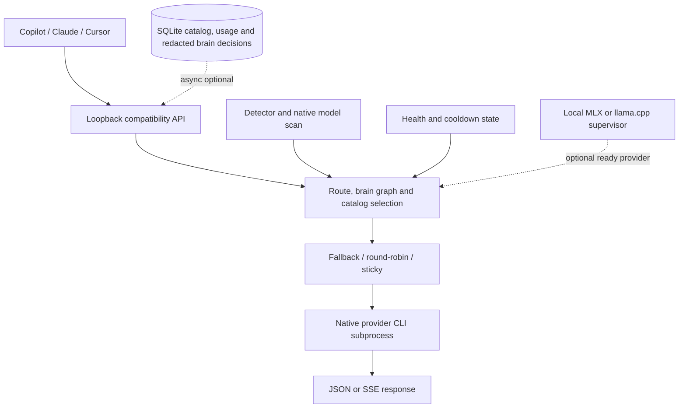

# Architecture

`ghrouter` is a local API gateway that sits in front of CLI-based AI providers.

## Request Flow

1. `main.go` loads configuration.
2. If no providers are configured, auto-discovery scans the PATH.
3. The startup bootstrap checks detected CLI, auth, catalog and optional local-backend readiness.
4. The default entrypoint opens the interactive terminal dashboard and shows startup/provider status.
5. `ghrouter serve` listens on `127.0.0.1:9090` by default.
6. Requests land on `/v1/chat/completions` or `/v1/messages`.
7. The server routes the requested model or prompt intent through the live catalog to a provider runner.
8. The runner spawns the provider CLI and parses its output.
9. The server returns JSON or SSE to the client.
10. A health loop and in-memory catalog stay active while the server runs.

## Main Packages

- `internal/config`: YAML loading and config path resolution.
- `internal/detectors`: CLI auto-discovery.
- `internal/local_brain`: backend detection, model cache checks, startup bootstrap.
- `internal/providers`: provider process execution and stream parsing.
- `internal/server`: OpenAI-compatible and Anthropic-compatible HTTP handlers.
- `internal/catalog`: model catalog, slots, and health-aware selection structures.
- `internal/health`: periodic passive provider health checks and health snapshots.
  These checks do not generate paid model requests and do not prove inference;
  actual routed requests and explicit probes add live success/error evidence.
- `docs/storage.md`: SQLite boundary for durable catalog, history, usage and audit state.

## Design Notes

- The current product is intentionally local-first.
- Provider CLIs are executed directly; no hidden MITM layer is used.
- Routing keeps the OpenAI-compatible surface stable for `gh copilot` while using catalog and health state to improve selection.
- Durable storage is optional and asynchronous; in-memory routing remains available if SQLite is unavailable.
- The current runtime is Brain-first. An empty local-brain configuration selects the default small MLX coding model, while explicit model/source choices remain authoritative. Startup readiness and process ownership are supervised; an unavailable Brain enters measured fast-backup mode and no eligible model produces an explicit request error.
- The current control plane has providers, models, routes and virtual lists. Typed connections, pools and combos are persisted and can be read or mutated through the admin-only aggregate/resource control-plane endpoints; the Bubble Tea TUI can inspect and edit selected resources as JSON.
- Chat Completions, Responses and Anthropic `fusion` routes fan out healthy candidates and optionally invoke a configured judge; first-complete cancellation and known-cost budgets are supported, while provider-specific cost discovery remains planned.
- Explicit `graph` routes run two bounded reasoning specialists in parallel and
  then an optional configured judge. Each specialist and judge attempt is
  recorded, while ordinary `auto` requests remain single-model to protect
  paid quota.

## Current versus planned flow

