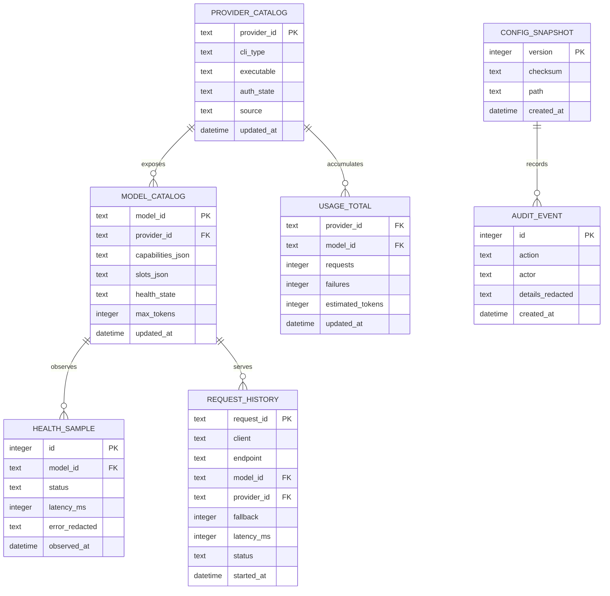

# Local storage and SQLite decision

> Status: local operational persistence is implemented; cost data is persisted
> when an explicit model token cost is configured; raw retention pruning is
> implemented while interactive history screens remain partial.

Ghrouter is local-first, so SQLite is a good fit for durable operational state
that must survive a restart without introducing a database service. It should
not become the synchronization primitive for the request hot path.

## Recommended responsibilities

| Data | SQLite role | Retention |
| --- | --- | --- |
| `provider_catalog` | discovered CLI, model IDs, capabilities and source version | replace on sync |
| `health_samples` | timestamped status, latency, error and cooldown transitions | bounded window |
| `request_history` | request ID, client, endpoint, selected model, fallback, latency and outcome | configurable, local-only |
| `usage_totals` | provider/model counters and token estimates | aggregate forever, raw rows bounded |
| `request_history.decision_json` | redacted brain intent, capability gates, cost class and task graph | retained with request history |
| `config_snapshots` | versioned config checksum and rollback metadata | last N snapshots |
| `audit_events` | ACL key rotation, reset, update and administrative actions | bounded or exportable |

The database must never contain API keys, OAuth tokens, prompt bodies, tool
arguments, or provider credential files. Request history stores hashes or
redacted metadata by default; payload capture must be an explicit opt-in.

## Current implementation boundary

Currently wired: provider/model catalog snapshots including native capability,
context, output, cost, effort, provenance and observed latency P50/P95 metadata, health samples from every
provider probe, config snapshots, startup and administrative audit events with
redacted, queryable history through `ListAudit` and authenticated
`GET /v1/audit`, `request_history` with
request/client/connection correlation, ordered attempts with connection
identity, token estimates and known-cost estimates,
`usage_totals`, asynchronous bounded queue accounting, writer error reporting,
close/drain behavior, and database permission repair. Request records do not
yet provide provider-specific cost discovery. Cost fields are zero when the provider does not
expose an explicit configured token cost. Durable `connections`, `pools`, and
`combos` snapshots are also written; `storage.retention_days` prunes raw
history, health, audit, and config snapshot rows at startup while preserving
aggregates and current snapshots. Interactive CRUD/history screens remain
partial.

The brain decision payload is deliberately not a knowledge store: it contains
only routing metadata and graph structure, never prompt bodies, tool arguments,
provider output, API keys, or OAuth tokens. Future semantic memory should use a
separate redacted fact table with explicit scope, provenance, confidence and
expiry; it must not be inferred from arbitrary request text.

## Runtime design

The router keeps the current catalog, health state, route state and circuit
breaker state in memory. A bounded writer receives immutable events through a
channel and commits batches to SQLite. HTTP handlers never wait for a database
write to route or stream a request. If SQLite is unavailable, routing continues
and the dashboard marks persistence as degraded.

SQLite should use:

- `journal_mode=WAL`
- `busy_timeout` with a short bounded value
- foreign keys enabled
- one serialized connection so connection-scoped PRAGMAs remain consistent
- parameterized statements only
- migrations with a schema version table
- restrictive file and directory permissions (`0700` directory, `0600` DB)

The live snapshot exposes SQLite queue depth, dropped events, committed events
and writer errors. The router also checks the active journal mode, foreign-key
setting and busy timeout before reporting persistence as healthy.

Schema changes are applied in explicit, ordered migrations. Existing legacy
databases are upgraded in place; a database from a newer unsupported router
version is rejected rather than opened with an incomplete schema.

## Suggested tables

## Rollout order

1. Add a storage interface and in-memory implementation so routing has no
   SQLite dependency.
2. Add migrations and a SQLite writer for catalog, health and usage events.
3. Add history and audit screens to the TUI.
4. Add export, retention and repair commands.
5. Exercise crash recovery, concurrent readers, WAL locking and migration
   upgrades in isolated integration tests.

The first implementation should use a maintained pure-Go SQLite driver already
approved for this project, or a platform-supported SQLite binary boundary. The
choice must be made before adding a dependency; SQLite is an operational
enhancement, not a reason to couple the router to CGO or block startup.
